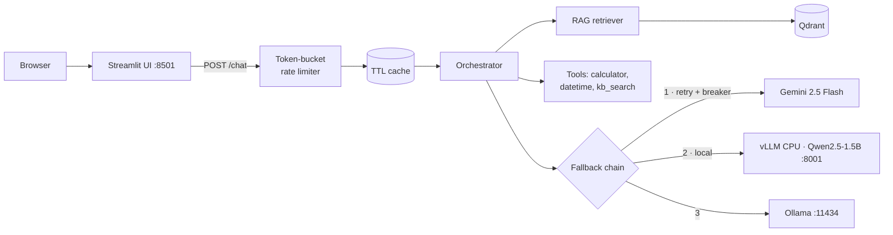

# WK15 — AI Assistant with RAG, Tool Calling & Local vLLM Fallback

Production-style AI assistant covering **both W15 tasks**: Task 1 (assistant with LLM API, prompt engineering, structured output, tool calling, RAG, local vLLM serving, Docker) and Task 2 (web UI, performance engineering, caching, retries, rate limiting, fallback provider, graceful degradation).

## Architecture



Full diagram and failure-mode analysis: [docs/architecture.md](docs/architecture.md)

## Quickstart

### 1. Backend + UI (cloud-only, fastest path)

```powershell
python -m venv .venv; .\.venv\Scripts\Activate.ps1
pip install -r requirements.txt
Copy-Item .env.example .env   # then set GEMINI_API_KEY
uvicorn app.main:create_app --factory --port 8000 --reload
# second terminal
streamlit run ui/app.py
```

Open <http://localhost:8501>.

### 2. Everything in Docker (includes local vLLM on CPU)

```powershell
docker compose --profile local up --build
```

- UI: <http://localhost:8501> · API: <http://localhost:8000/docs> · vLLM: <http://localhost:8001/v1> · Qdrant: <http://localhost:6333/dashboard>
- The `vllm` image bakes the Qwen2.5-1.5B-Instruct weights at build time (`Dockerfile.vllm`), and the API image pre-downloads the MiniLM embedding model — both containers run offline-ready. First build downloads ~3 GB (vLLM weights) plus ~250 MB (CPU torch + embedder), which keeps runtime cold starts network-free.
- Without the `local` profile only `api` + `ui` + `qdrant` start (Gemini/Ollama still reachable).

### 3. Ollama fallback (host)

```powershell
ollama pull qwen2.5:1.5b-instruct
```

The API reaches it at `http://localhost:11434/v1` natively, or `host.docker.internal` from inside compose.

## API

| Method | Path       | Purpose                                        |
|--------|------------|------------------------------------------------|
| POST   | `/chat`    | `{message, use_rag, use_tools}` → structured `ChatResponse` |
| POST   | `/ingest`  | Re-index `data/docs/` into the Qdrant collection |
| GET    | `/health`  | Uptime, indexed-doc count, per-provider breaker state |
| GET    | `/tools`   | OpenAI-format tool specs                       |

```powershell
curl -X POST http://localhost:8000/chat -H "Content-Type: application/json" `
  -d '{\"message\": \"What is chunking in RAG?\"}'
```

## How requirements map to code

| Requirement | Where |
| --- | --- |
| LLM integration | `app/providers/base.py` (OpenAI-compatible client) |
| Prompt engineering | `app/prompts.py`, temperature/top_p in `app/config.py` |
| Structured output | JSON-schema `response_format` + Pydantic validation in `app/orchestrator.py` |
| Tool calling | `app/tools/__init__.py` + tool loop in orchestrator |
| RAG ingestion/chunking | `app/rag/ingest.py` (paragraph-aware, overlapping chunks) |
| Embeddings + vector DB | Explicit sentence-transformers embedder (`app/rag/embeddings.py`) over Qdrant (`app/rag/store.py`) |
| Local model via vLLM | `Dockerfile.vllm` (CPU wheel, baked Qwen weights) |
| Containerization | `Dockerfile`, `docker-compose.yml` |
| Web UI connected to backend | `ui/app.py` |
| Concurrency / async | Fully async FastAPI endpoints, non-blocking OpenAI calls |
| Latency optimization | TTL+LRU response cache, bounded context, small local model |
| Retry mechanism | `with_retries` in `app/resilience.py` |
| Rate limiting | Per-client token bucket middleware in `app/main.py` |
| Fallback model/provider | Provider chain in `app/providers/__init__.py` |
| Error handling & graceful degradation | Breakers + degraded answers built from retrieved passages |
| Caching (bonus) | `app/cache.py` |

## Model choices (deliberate)

- **Gemini 2.5 Flash** — primary. The assignment grades pipeline engineering, not raw model quality; Flash keeps iteration fast and cheap.
- **Qwen2.5-1.5B-Instruct via vLLM (CPU)** — satisfies "serve an open-source model locally with vLLM" without being undemoable on CPU-only hardware.
- **Ollama qwen2.5:1.5b-instruct** — final fallback, already running Arc-accelerated on this machine.
- **all-MiniLM-L6-v2 via sentence-transformers** — explicit, swappable embedder decoupled from any vector-DB default; runs CPU-friendly at 384 dims.

All three providers speak an OpenAI-compatible API, so a single client implementation covers them — that's what makes the fallback chain ~40 lines instead of three integrations.

### ONNX & inference optimization (Task 2)

Why conversion is not applicable here, per model:

- **Gemini 2.5 Flash (primary)** — consumed as a hosted API; we hold no weights to convert.
- **Qwen2.5-1.5B-Instruct (local)** — served by vLLM, which *is* the inference-optimization layer: paged KV-cache attention, continuous batching, and fused CPU kernels. An ONNX export would bypass those optimizations rather than add to them, and would break the "serve locally with vLLM" requirement. Optimization effort therefore goes into vLLM configuration instead — bounded context (`--max-model-len 4096`) and KV-cache sizing (`VLLM_CPU_KVCACHE_SPACE`) in `Dockerfile.vllm`.
- **all-MiniLM-L6-v2 embedder** — the one locally-owned model where ONNX export is genuinely feasible. Deferred deliberately: at this corpus scale embedding latency is negligible next to generation latency, and the swap would add an export/runtime dependency for no measurable gain. First candidate to revisit if the corpus grows by orders of magnitude.

Net effect: the "apply inference optimizations if supported" line is satisfied through vLLM's serving stack rather than a redundant ONNX hop.

## Known trade-offs

Deliberate scope cuts, documented rather than hidden:

- Chunking is char-based (~900 chars, 150 overlap), not token-aware — a tiktoken/sentence-aware splitter is a contained upgrade to `chunk_text`.
- `POST /ingest` rebuilds the whole collection instead of incremental upserts — correct and simple for this corpus size.
- No re-ranking or hybrid search; single-shot dense retrieval only.
- Cache and rate limiter are in-process; run one worker per replica or swap for Redis when scaling horizontally.

## Tests

Offline/hermetic (fake embedder, stub providers — no network, no API key):

```powershell
pytest -q
```

Covers chunking, retrieval ranking, cache TTL/LRU, retry/backoff, circuit breaker transitions, token-bucket limiting, fallback chain ordering, calculator sandboxing, and full HTTP round-trips including cached hits, 429s, and graceful degradation.

## Configuration

All settings are env-driven (see `.env.example`): provider order, models, timeouts, retry/breaker thresholds, rate limits, cache size, chunk size/overlap, top_k, embedding model, and Qdrant mode (`QDRANT_URL` empty = embedded-local file store; set = server mode).

## Deployment notes (bonus)

Compose file deploys as-is to any Linux VM with Docker. For Azure Container Apps: `az containerapp up --source .` with the same image, or push to ACR and reference from a Container App environment; set `GEMINI_API_KEY` as a secret. Not executed here to keep the deliverable reproducible offline.
