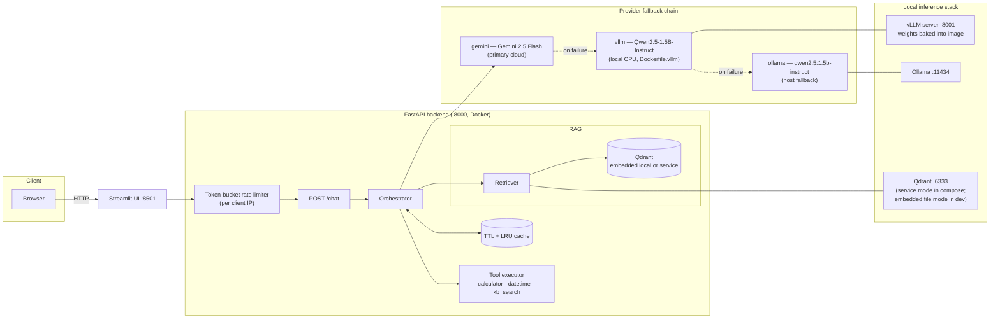
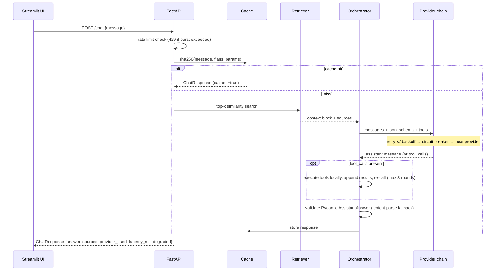

# Architecture

## Component diagram

## Chat request sequence

## Reliability design

| Failure | Mechanism | User-visible behavior |
|---|---|---|
| Transient network/API error | Exponential backoff + jitter (default 3 attempts) | Slight latency increase |
| Provider persistently failing | Circuit breaker opens after N failures, half-open probe after cooldown | Requests skip dead provider instantly |
| Gemini quota/auth missing | Chain falls through to vLLM, then Ollama | Answer served by local model |
| All providers down | Degraded response synthesized from retrieved passages | 200 with `degraded: true`, never a crash |
| Malformed JSON from weak model | Fence-stripping + regex extraction before giving up | Raw text answer instead of error |
| Request flood | Token bucket (60 rpm, burst 20 per IP) | 429 with Retry-After |
| Vector store unreachable | Retrieval wrapped in try/except; chat continues without grounding context (logged) | 200 with no sources, answer from general knowledge |
| Repeated identical question | TTL cache (300 s, 512 entries) | Instant response, `cached: true` |

## Performance notes

- Endpoints are fully async; provider calls never block the event loop.
- The embedding model loads lazily on first ingest/query and is pre-baked into the Docker image, so dev startup stays fast while containers stay network-free.
- Cache keys hash message + flags + sampling params, so toggling RAG/tools misses deliberately.
- Single uvicorn worker keeps the in-process cache/rate-limiter coherent; scale by running replicas behind a proxy (swap the in-memory pieces for Redis when you do).
- The local model choice (1.5B, max_model_len 4096, KV-cache 4 GB) trades capability for demoable latency on CPU-only hardware.
